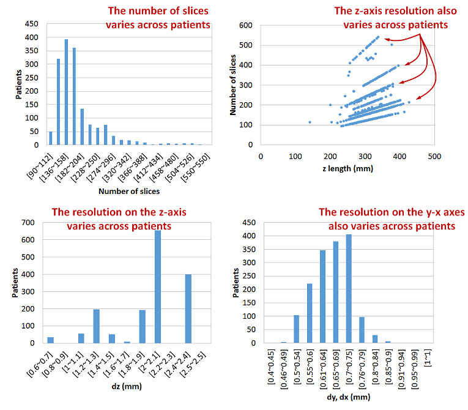

# Data preprocessing

## Exploratory data analysis

##### Note
* The [get_header.py]() and [summarize_data.py]() scripts in the scripts/EDA folder can be used to scan all the patients DICOM files and summarize the field values (except for the PixelData field) into a CSV file useful for EDA.

### DICOM format

#### Data fields
The [DICOM](http://dicom.nema.org/) standard define several fields to hold many kinds of information including the equipment setup, the patient information, the measurement conditions, etc. Below are listed some of such fields. The fields that particularly useful/important to preprocess the data and build the arrays are in **bold**, and those masked to protect the privacy of the patients are ~~strikethrough~~.

| Fields                        | Fields (cont.)          | Fields (cont.)        |
|-------------------------------|-------------------------|-----------------------|
| **PixelData**                 | **RescaleSlope**        | CompressionCode       |
| **BitsStored**                | **Rows**                | ImageDimensions       |
| BurnedInAnnotation            | **Columns**             | ImageFormat           |
| **ImageOrientationPatient**   | **SamplesPerPixel**     | ImageLocation         |
| **ImagePositionPatient**      | SeriesDescription       | NumberOfFrames        |
| Modality                      | SeriesInstanceUID       | PixelAspectRatio      |
| ~~PatientBirthDate~~          | SeriesNumber            | LossyImageCompression |
| ~~PatientName~~               | SliceLocation           | Laterality            |
| PhotometricInterpretation     | PatientOrientation      | SourceImageSequence   |
| **PixelPaddingValue**         | PlanarConfiguration     | TemporalPositionIndex |
| PixelRepresentation           | RescaleType             | VolumetricProperties  |
| **PixelSpacing**              | LargestImagePixelValue  | ~~Allergies~~         |
| **RescaleIntercept**          | SmallestImagePixelValue | ~~PregnancyStatus~~   |

#### Field meanings
| Field                   | Meaning                                                                     | Example value |
|-------------------------|-----------------------------------------------------------------------------|---------------|
| Pixel data              | Raw slice pixel data                                                        | Array         |
| BitsStored              | Bit resolution of pixels in slice                                           | 12            |
| ImageOrientationPatient | Orientation of image plane respect to the patient’s axes of coordinates     | [1,0,0,0,1,0] |
| ImagePositionPatient    | Position of image plane respect to the equipment’s axes of coordinates      | -50 mm        |
| PixelPaddingValue       | Value of pixels outside of scanner area for padding to a rectangular format | 2000          |
| PixelSpacing            | Gap between pixels (spatial resolution)                                     | 0.65 mm       |
| RescaleIntercept (Ri)   | Intercept of linear transformation Raw -> HU                                | -1024         |
| RescaleSlope (Rs)       | Slope of linear transformation Raw -> HU                                    | 1             |
| Rows                    | Number of rows in slice                                                     | 512           |
| Columns                 | Number of columns in slice                                                  | 512           |
| SamplesPerPixel         | Number of channels per pixel                                                | 1             |

#### Slice example
A single slice of CT scan is an image array, typically is taken along the transverse plane of the patient, whose pixels values are measured in [Hounsfield Units (HU)](https://en.wikipedia.org/wiki/Hounsfield_scale), a unit that quantifies the radiodensity of diverse materials. As can be seen in the slice example below, the HU can take both positive and negative values, an follow a multimodal distribution where each lump in the distribution represent the most frequent materials inside the patient's body such as water, soft tissue and air.

#### Number of slices and resolution
The distribution of the number of slices and spatial resolution is shown in the histograms below. It can be seen that the number of slices and spatial resolution (and thus the total scanned volume size) is very heterogeneous across patients. Isotropic resampling is required to homogenize the spatial resolution before feeding the arrays into the models.

## Preprocessing
For each patient, the CT scan slices are preprocessed and merged into a single 3D array by applying the operations shown in the figure below. For the particulars of each operation in the pipeline refer to the [preprocessing.py]() module.

Below is shown an example of the array obtained after preprocessing the CT scan slices.

The size of the lung array along the z-y-x axes vary across patients and thus the model should be able to handle arrays of varying size.

