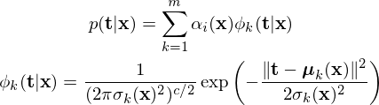
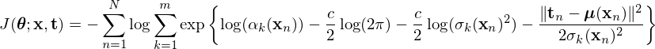
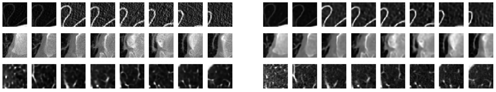
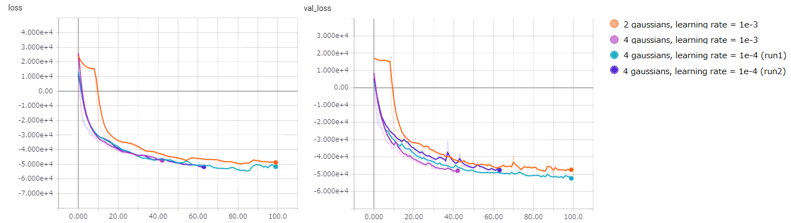

# Gaussian Mixture Convolutional AutoEncoder for feature learning on 3D CT lung scan data (Keras/TensorFlow implementation)

## Notes
* **This is still work in progress.**
* For the source code and requirements please refer to [Repository info](#repository-info).
* The Keras/TensorFlow implementation of the Gaussian Mixture Negative Log-Likelihood loss is in [losses.py](kdsb17/losses.py). It is created by calling the ```build_gmd_log_likelihood(c, m)``` function.
  * For details refer to [this section](#using-the-code-for-gaussian-mixture-density-in-your-project) and the source code.
* Custom Keras objects that define the ```ShiftedELU```, ```log_softmax``` to parametrize  the log-priors and variances are implemented [here](kdsb17/advanced_activations.py) and [here](kdsb17/activations.py).

## Description
This is an attempt at the classification task featured in the [Kaggle Data Science Bowl 2017](https://www.kaggle.com/c/data-science-bowl-2017). The task consists on predicting from CT lung scans whether a patient will develop cancer or not within a year. This is a particularly challenging problem given the very high dimensionality of data and the very limited number of samples.

The competition saw many creative approaches, such as those reported by the winning entries [here](https://github.com/lfz/DSB2017) (1st place), [here](http://blog.kaggle.com/2017/06/29/2017-data-science-bowl-predicting-lung-cancer-2nd-place-solution-write-up-daniel-hammack-and-julian-de-wit/) (2nd place) and [here](http://blog.kaggle.com/2017/05/16/data-science-bowl-2017-predicting-lung-cancer-solution-write-up-team-deep-breath/) (9th place). These approaches have in common that:

1. they are based on deep CNNs;
2. leverage external data, in particular the [LUNA dataset](https://luna16.grand-challenge.org/);
3. make extensive use of ensemble of models.

What I'm attempting here is a rather more "purist" (for lack of a better word) approach that uses no ensemble models and no external data. The purpose of this is simply to explore the possibility of achieving a decent classification accuracy using a single model and using solely the provided data. The current attempt consists of a combination of two neural networks:

* Gaussian Mixture Convolutional AutoEncoder (GMCAE): A convolutional autoencoder cast as Mixture Density Network ([Bishop, 1994](https://www.microsoft.com/en-us/research/publication/mixture-density-networks/)). This network is used to learn high-level features of patches of lung scans (3D arrays of CT scans in Hounsfield Units), using unsupervised learning and maximum likelihood on a mixture of Gaussians.
* CNN classifier: Performs binary classification upon the features extracted by the encoding layers of the GMCAE.


## Data details (Data from Stage 1 of the competition)

The data consists on a set of CT scan slices of 1,595 patients stored in DICOM format. For each patient a 3D array is constructed by merging the slices, applying appropriate preprocessing, and extracting the lung area. Each patient's 3D array constitutes a sample and it has associated a binary label indicating whether it was diagnosed with cancer or not within a year. The details of preprocessing are explained [here](DataPreprocessing.md).

### Dataset structure
* Train: 1397 samples (1 sample = 1 patient)
  * Training (~80%): 1117 samples (291 cancerous)
  * Validaton (~20%): 280 samples (71 cancerous)
* Test: 198 samples

## Model details
The current architecture of both networks is summarized in the figure below:


### Gaussian Mixture Convolutional AutoEncoder (GMCAE)
The purpose of this network is to learn features from the 3D CT lung arrays that could be transferred to the second network for classification. This is done through unsupervised learning using an autoencoder with a reconstruction task.

#### Why Gaussian Mixture?

As a reconstruction objective for the autoencoder, one could attempt to minimize a MSE objective, but this would fail because the CT scan voxels have a multimodal distribution (as shown in [here](illustrations/slice_example.png)) and a MSE objective would tend to predict the average of the distribution and thus likely yield meaningless predictions. This is because a MSE objective is equivalent to maximizing the log-likelihood assuming a (uni-modal) Gaussian distribution for the conditional probability of the output given the data.

Thus, the conditional probability is instead formulated as a mixture of Gaussians as below:



Where **m** is the number of gaussians in the mixture, and **c** is the number of output dimensions (number of voxels in the reconstruction). The GMCAE is trained to produce outputs that determine the parameters **alpha** (priors), **sigma^2** (variances) and **mu** (means) of the mixture of Gaussians. **alpha**, **sigma** and **mu** are functions of **x** and the network parameters **theta**. Since we are doing reconstruction, **t**=**x** in this case. Specifically, the network is trained to minimize the following loss function:



In this formulation, the priors and normalizing constants of the Gaussians are moved inside the exponential function, allowing to represent the loss as a logsumexp and improve numerical stability.

#### Setup
* Input:
  * A 3D sub-array corresponding to a cube patch of fixed size, big enough to contain a lung nodule.
  * Currently the sub-arrays are set as 32x32x32 arrays corresponding to a cube of 3.2 mm.
  * Data augmentation is performed by random rotations/mirroring of the sub-arrays. Since a cube has 48 symmetries this allows a 48-fold augmentation (ignoring the effects of gravity).
* Outputs:
  * **log(alpha)**: A vector of **m** elements that correspond to the log priors of each Gaussian in the mixture. The log priors are parametrized with a LogSoftmax activiation.
  * **sigma^2**: A vector of **m** elements that correspond to the variances of each Gaussian. The original paper of Mixure Density Networks suggests parametrizing the variances with an exponential activation function. However, an exponential function is prone to numerical instability, and here instead use a ShiftedELU activation. This is just the ELU activation with an added constant of 1, such that the output is always greater than zero. [Another work on Mixture Density Networks also came up with this idea before](https://github.com/axelbrando/Mixture-Density-Networks-for-distribution-and-uncertainty-estimation).
  * **mu**: A 4-D tensor with the means (array reconstructions) of each Gaussian. This is parametrized with a linear activation function.
* Loss function
  * Negative Log likelihood given by the above equation.
  

### CNN Classifier
The task of this network is to classify the patients upon the features transferred from the GMCAE. The output is a single sigmoid unit, and the network is trained to minimize the Log Loss. Since the model should be able to handle arrays of variable size, a Spatial Pyramid Pooling layer ([He, 2014](https://arxiv.org/abs/1406.4729)) is used to interface between the convolutional and fully-connected layers.

#### Setup
* Input:
  * Full 3D array of lung area.
  * Data augmentation is performed by random rotations/mirroring of the sub-arrays. Since a cube has 48 symmetries this allows a 48-fold augmentation (ignoring the effects of gravity).
* Output:
  * Probability of being diagnosed with cancer within a year.
* Loss function
  * Log loss (aka binary crossentropy).

## Current results

### Gaussian Mixture Convolutional AutoEncoder (GMCAE)

#### Reconstructions
An example of the reconstruction computed with the GMCAE using a mixture of 4 Gaussians is shown below. The 24 slice patches on the left are the original, and those on the right are the reconstructions produced by the model.



#### Train/Validation loss
The train and validation loss for **m** = 2, 4 is shown below.
* The log likehood can take negative values because point estimates of the density can take values greater than 1 if the variances are made small enough.



### CNN Classifier
So far a validation loss of around 0.57 and an accuracy of about 74% (par with chance level), which is still quite far from the winning entries (logloss around 0.40).

### Current issues
 * Gradient explosion
   * It's hard to stabilize the gradients. So far, I've been able to control the gradients with small learning rates and/or gradient norm clipping.
    * I also tried to parametrize directly the inverse variance but it wasn't helpful.
    * Also tried fixing the variances to a constant value (determined empirically) but that didn't work either.
 * Unknown lower bound of loss function
   * The Gaussians in the mixture are densities, so point estimates of the likelihood can yield negative values if the variances are small enough.
   * Having variable variances and priors makes it difficult to estimate a lower bound of the loss function, which also makes difficult to know how much the model is underfitting the data.

## Repository info
### Contents
* **kdsb17**:

  Contains the custom modules for data pre-processing, and building and training the models.

* **scripts**:
  
  Contains the scripts to preprocess the data, train the models and predict.
  
### Using the code for Gaussian Mixture Density in your project
* Feel free to use these functions in your project if you find them useful. Just let me know if you found it useful :)

The Keras/TensorFlow implementation of the Gaussian Mixture Negative Log-Likelihood loss is in [losses.py](kdsb17/losses.py). It is created by calling the ```build_gmd_log_likelihood(c, m)``` function.
  * ```build_gmd_log_likelihood(c, m)``` takes two parameters: the number of output dimensions **c** and the number of Gaussians in the mixture **m**.
  * To use this loss function the output shape must be ```(samples, m*(c + 2))```, with the second dimension encoding the mixture parameters in the following order:
    * m log-priors (outputs of a log-softmax activation layer)
    * m variances (outputs of a ShiftedELU activation layer)
    * m*c means (outputs of a linear activation layer)
  * The target data must be of shape ```(samples, c)```.
* Custom Keras objects that define the ```ShiftedELU```, ```log_softmax``` to parametrize  the log-priors and variances are implemented [here](kdsb17/advanced_activations.py) and [here](kdsb17/activations.py).
* **Important**: Due to the inverse variance term in the loss function, it is not uncommon to encounter exploding gradients and NaNs when training your model. You might need to use small learning rates and/or gradient norm clipping to stabilize the gradients.

### Requirements
* Python 3
* Keras 2.0.6
* tensorflow-gpu 1.2.1
* numpy 1.13.0
* scipy 0.19.1
* pydicom 0.9.9
* CUDA Version 8.0.61
